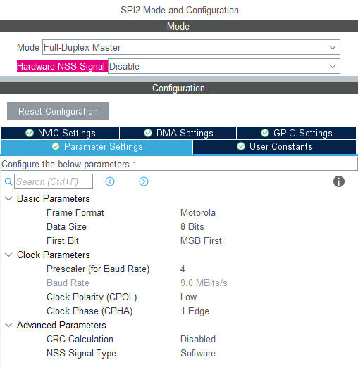
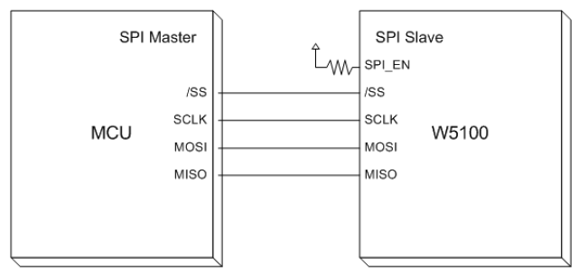
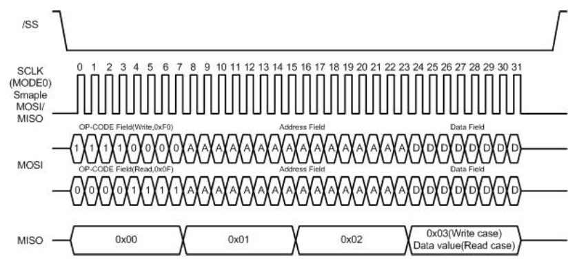
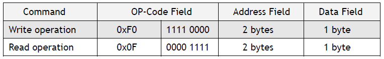
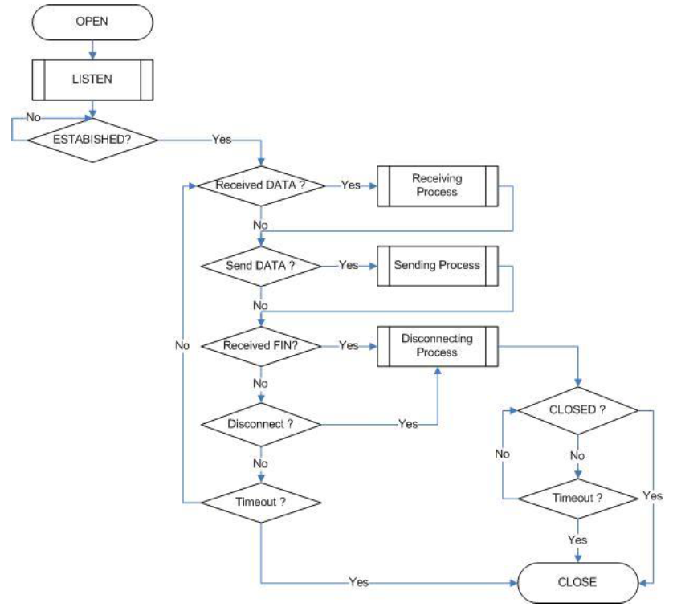
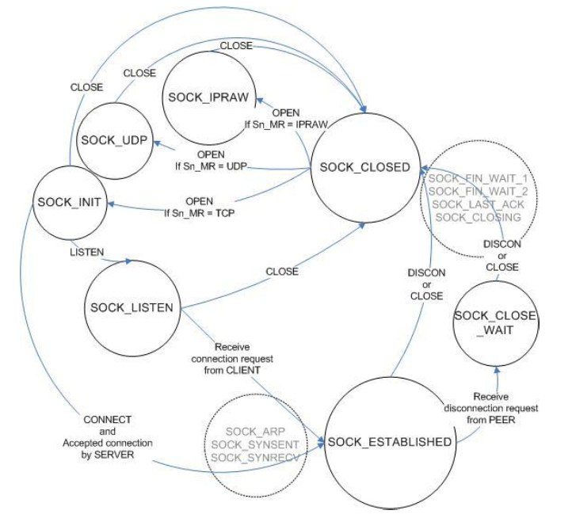

# STM32_ETH_W5100
 Desarrollo de biblioteca para modulo WIZNET W5100 conectado por SPI.
## Configuracion del Micro 
El W5100 soporta comunicaciones SPI con un clock de hasta 14 MHZ, para este caso se setea un perscaler de 4 y se obtiene una freceuncia de clock de 9 MHz.
En pruebas realizadas a 18MHz se obervan errores en la lectura de datos.
`$ npm install marked`


### Código 
```c
static void MX_SPI2_Init(void)
{

  /* USER CODE BEGIN SPI2_Init 0 */

  /* USER CODE END SPI2_Init 0 */

  /* USER CODE BEGIN SPI2_Init 1 */

  /* USER CODE END SPI2_Init 1 */
  /* SPI2 parameter configuration*/
  hspi2.Instance = SPI2;
  hspi2.Init.Mode = SPI_MODE_MASTER;
  hspi2.Init.Direction = SPI_DIRECTION_2LINES;
  hspi2.Init.DataSize = SPI_DATASIZE_8BIT;
  hspi2.Init.CLKPolarity = SPI_POLARITY_LOW;
  hspi2.Init.CLKPhase = SPI_PHASE_1EDGE;
  hspi2.Init.NSS = SPI_NSS_SOFT;
  hspi2.Init.BaudRatePrescaler = SPI_BAUDRATEPRESCALER_4;
  hspi2.Init.FirstBit = SPI_FIRSTBIT_MSB;
  hspi2.Init.TIMode = SPI_TIMODE_DISABLE;
  hspi2.Init.CRCCalculation = SPI_CRCCALCULATION_DISABLE;
  hspi2.Init.CRCPolynomial = 10;
  if (HAL_SPI_Init(&hspi2) != HAL_OK)
  {
    Error_Handler();
  }
  /* USER CODE BEGIN SPI2_Init 2 */

  /* USER CODE END SPI2_Init 2 */

}
```
## Conexion con el dispositivo



## Señales



#TCP Server
## Flujo de trabajo 



## Maquina de estados 

### De la libreria de wiznet


void recv_data_processing(SOCKET s, uint8 *data, uint16 len)
{
	uint16 ptr;
	ptr = IINCHIP_READ(Sn_RX_RD0(s));
	ptr = ((ptr & 0x00ff) << 8) + IINCHIP_READ(Sn_RX_RD0(s) + 1);
#ifdef __DEF_IINCHIP_DBG__
	printf("ISR_RX: rd_ptr : %.4x\r\n", ptr);
#endif
	read_data(s, (uint8 *)ptr, data, len); // read data
	ptr += len;
	IINCHIP_WRITE(Sn_RX_RD0(s),(uint8)((ptr & 0xff00) >> 8));
	IINCHIP_WRITE((Sn_RX_RD0(s) + 1),(uint8)(ptr & 0x00ff));
}

void read_data(SOCKET s, vuint8 * src, vuint8 * dst, uint16 len)
{
	uint16 size;
	uint16 src_mask;
	uint8 * src_ptr;

	src_mask = (uint16)src & getIINCHIP_RxMASK(s);
	src_ptr = (uint8 *)(getIINCHIP_RxBASE(s) + src_mask);
	
	if( (src_mask + len) > getIINCHIP_RxMAX(s) ) 
	{
		size = getIINCHIP_RxMAX(s) - src_mask;
		wiz_read_buf((uint16)src_ptr, (uint8*)dst,size);
		dst += size;
		size = len - size;
		src_ptr = (uint8 *)(getIINCHIP_RxBASE(s));
		wiz_read_buf((uint16)src_ptr, (uint8*) dst,size);
	} 
	else
	{
		wiz_read_buf((uint16)src_ptr, (uint8*) dst,len);
	}
}


